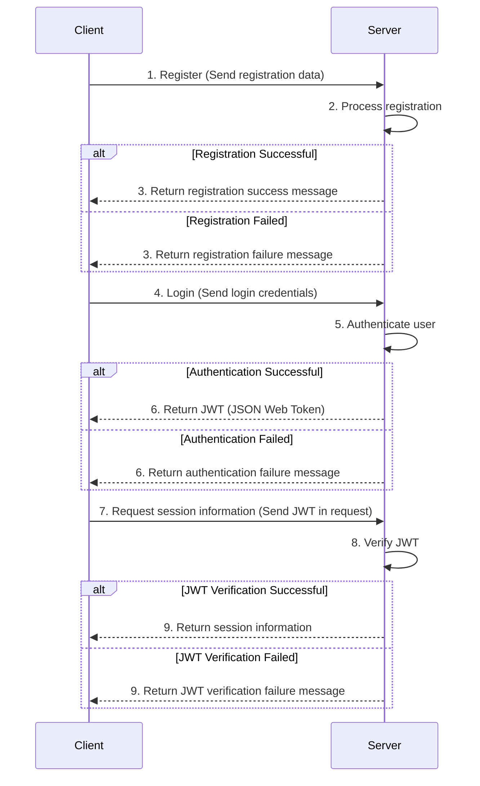

# go-jwt

simple JSON web tokens

```mermaid
sequenceDiagram
    participant Client
    participant Server

    Client ->> Server: 1. Register (Send registration data)
    Server ->> Server: 2. Process registration
    alt Registration Successful
        Server -->> Client: 3. Return registration success message
    else Registration Failed
        Server -->> Client: 3. Return registration failure message
    end

    Client ->> Server: 4. Login (Send login credentials)
    Server ->> Server: 5. Authenticate user
    alt Authentication Successful
        Server -->> Client: 6. Return JWT (JSON Web Token)
    else Authentication Failed
        Server -->> Client: 6. Return authentication failure message
    end

    Client ->> Server: 7. Request session information (Send JWT in request)
    Server ->> Server: 8. Verify JWT
    alt JWT Verification Successful
        Server -->> Client: 9. Return session information
    else JWT Verification Failed
        Server -->> Client: 9. Return JWT verification failure message
    end
```